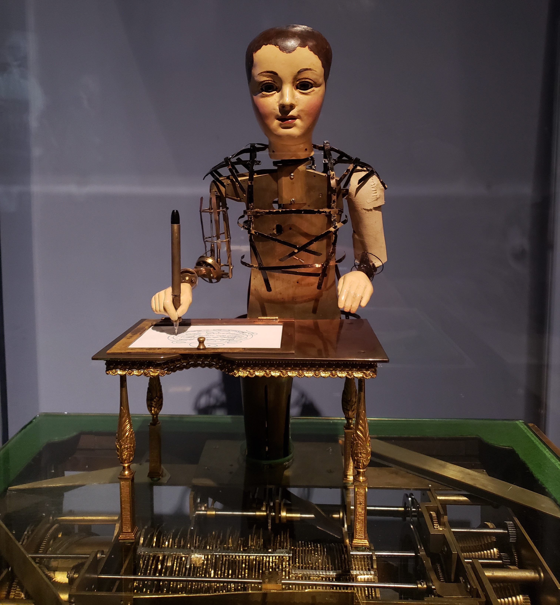

<iframe width="560" height="315" src="https://www.youtube.com/embed/7ZiH7oF3OMM" frameborder="0" allow="accelerometer; encrypted-media; gyroscope; picture-in-picture" allowfullscreen></iframe>

I recently saw **The Draughtsman Writer** at a larger exhibit (name?) at the Met, **Technology In the Age of the Court**. Most of the exhibits were clever, if sometimes dazzling: many immensely complicated clockworks, constructed with gold and other precious minerals, but nothing truly blew me away until the exhibits at the show's end, and in particular 'The Draughtsman Writer'.

Along with our Draughtsman was his more famous cousin **The Chess Player** (sometimes called 'The Turk' because of his garb), a replication of the original automaton by Wolfgang Von Kepeler in 1769, which 'played' chess with prominent figures across Europe, and which was eventually revealed as a fraud, manned by skilled, even famous chess players hidden from view yet operating the Chess Player's mechanical arms (I'm not entirely clear how they did this).

The Draughtsman Writer, however, needs no human intervention, except perhaps for a key to be wound up so that the Draughtman's profoundly intricate gears, hidden in the Draughtsman's desk, can begin turning, then a human hand to place the paper that with Draughtsman will fill with his exquisitely intricate drawings and poems. From the exhibit notes:

> Maillard hid the mechanices of the **Draughtsman Writer** in a cabinet rather than the figure. This allowed for larger machinery and greater memory than in earlier efforts . . . an unprecedented three poems and four drawings are drawn by the figure, through a technology that foretold the computer.

Incredibly, when Pittsburgh's Franklin Institute received the automaton in 1928, it was so damaged by the fire in the warehouse where it had been stored, they had no idea it was an automaton. They knew it had some mechanical function but, since it was in pieces, they had no idea what that function was. They didn't even known the name of the inventor.

I was instantly captivated by the Draughtsman Writer. In part it was the instance of an early robot. No uncanny valley here - the automaton is only half-formed (many of its panel, its 'skin' possibly lost in the fire), with a young man's dummy head, yet none of the creepiness we associate with a ventriloquist's dummy. This is a benign, contemplative figure, eyes focused downward on its task, its transparently mechanical arm composed of brass strips, an almost human hand holding a pen, tracing delicate lines across the page fitted into the Draughtsman's desk. As one of the curators says:

> Normally we think of robots moving in very mechanical ways, very jerky movements. This machine is by far the most elegant in its movements.

The Draughtsman can compose four different pictures, including drawings of a Chinese temple and a ship, and write three poems, one in English, two in French. The 'hard drive' for these movements are the brass disks housed below the surface of the Draughtsman's desk. The disks have hills and valleys on their surfaces, and a needle follows these grooves up and down, the collection of disks allowing for the most extensive mechanical memory of any known automaton.

The moving automaton was confined to a video next to the exhibit (as it was with all the other exhibits, presumably too old, too delicate for the repeat performances the exhibit would demand). Instead, in the actual exhibit, the Draughtsman peers straight ahead, eyes wide open, pen poised in its hand, waiting for the human intervention to fulfill its function and begin drawing and writing again.

I was struck, watching the video again, by the beauty of the calligraphy, the detail in each drawing. What a watchmaker Maillard must have been, to so precisely record each groove in his brass discs, long before the plastic record album would perform the same function. What might have Maillard done with a computer, with modern computer languages?

What also struck me is the essential frivolity of the Draughtsman Writer. Maillard likely built it to impress the court, as a sort of calling card. But essentially our Draughtsman exists to produce art, no more, no less. Sometimes I wonder if our machines shouldn't be, at least partially, repurposed to do the same - not just for convenience, 'communcation', 'disruption' but to produce beauty, wonder. When our machines, our AI, can acheive some of the pure wonder of the Draughtsman Writer, will we able to say the Digital/ AI revolution has matured, been absorbed into our human fabric (instead of threatening to run amok as it is now?
